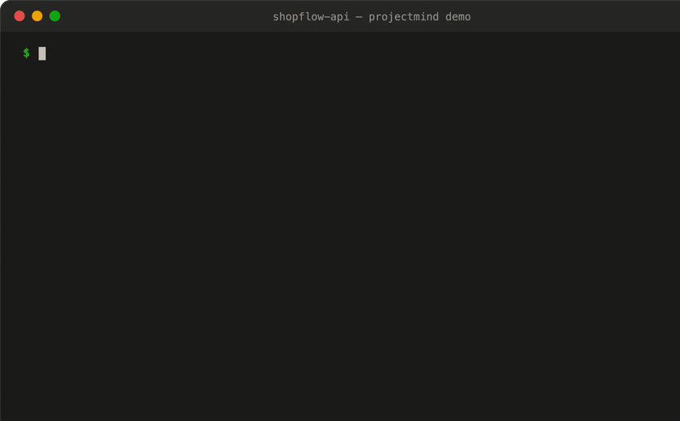
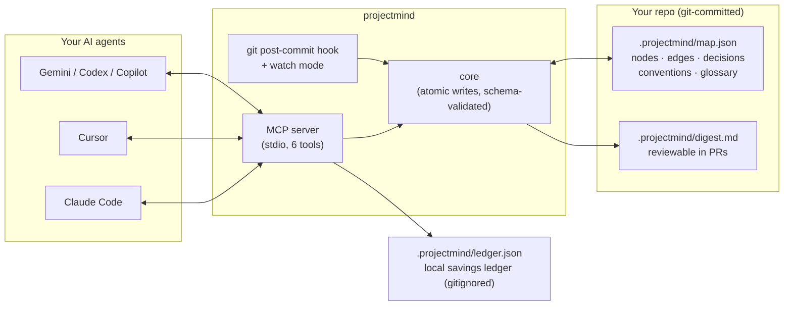

# projectmind

**Persistent, compact project memory for AI coding agents.** Your agent reads one
small digest instead of re-scanning the codebase every session — and a local
ledger shows you exactly how many tokens (and dollars) that saved.

[](https://github.com/Nodemint-dev/projectmind/actions/workflows/ci.yml)


-success)





Every AI coding session starts the same way: the agent has no memory of your
project, so it re-reads files, re-derives your architecture, or asks you to
re-explain decisions you made months ago. You pay for that in tokens, time, and
wrong guesses — every single session, on every machine, for every teammate.

`projectmind` fixes this with a **structured, git-committed project map**
(`.projectmind/map.json`): your modules, their dependencies, your architectural
decisions, your conventions, your domain glossary. The agent reads a ~400-token
digest first, drills into single nodes only when needed, and writes back what it
learns — so the *next* session (yours, a teammate's, or a different AI tool's)
starts already knowing the project.

The digest scales with your project's *conceptual* size (modules, decisions),
not its *byte* size — so the savings grow with the repo.

## Quick start

```bash
npm install -g @nodemint/projectmind        # installs the `projectmind` CLI
cd your-repo
projectmind init --seed           # scaffold + propose a starter map from your repo layout
projectmind setup                 # wire the MCP server + rules into every agent you use
projectmind install-hook          # optional: auto-update module freshness on commit
```

That's it. Your agent now calls `mind_digest` at the start of a task instead of
scanning files.

## See what it saves you — measured, not promised

The MCP server keeps a **local savings ledger**: every time your agent reads the
map instead of scanning files, it records the tokens actually served vs. the
estimated tokens of the files the agent would have read instead.


Check it anytime:

```
$ projectmind savings
projectmind savings (estimated — local ledger, never leaves this machine)

  Total saved:   ~20.5k tokens across 22 map read(s)
  ≈ $0.0614 at sonnet-tier input pricing ($3/MTok, as of 2026-06)
  Today:         ~20.5k tokens (22 read(s))

  By tool:
    mind_digest      12 reads   ~18.5k saved
    mind_query        6 reads   ~1210 saved
    mind_context      4 reads   ~712 saved

  Methodology: tokens ≈ ceil(bytes/4); baseline = files the agent would have read instead.
```

The dollar figure needs **zero configuration**: it defaults to Sonnet-tier input
pricing from a built-in table of published rates (Haiku $1 / Sonnet $3 / Opus $5
/ Fable $10 per MTok input, as of June 2026), and says exactly which assumption
it used. If you run a different model, set `savings.model` (or an exact
`savings.inputPricePerMTok`) in `.projectmind/config.json` — but nobody has to.

*(Real output from a scripted day of agent work on the sample project in
`test/fixtures/` — 12 session starts, 6 module drill-ins, 4 task-context reads.
Reproduce the per-session number with `npm run benchmark`.)*

**VS Code status bar:** the [`integrations/vscode`](integrations/vscode) extension
shows a live `✦ ~20.5k tokens saved` counter that reads the same local ledger.
Zero dependencies, zero network.

The ledger is honest by design: every number is labelled an **estimate**
(`ceil(bytes ÷ 4)`, the rough English+code average), savings are floored at zero,
and the file is gitignored — it's your private data, on your machine, deletable
at any time.

## Session handoff — pick up exactly where you left off

The thing every agent session loses is *working state*: what you were in the
middle of, what's next, the gotcha you just discovered. Code graphs can't
capture it; chat history dies with the session. projectmind carries it over:

```
$ projectmind digest
# shopflow-api — project map
Order-management HTTP API with JWT auth, backed by PostgreSQL.
Stack: node, express, postgres

## ⏪ Handoff from last session (2026-07-02)
Adding refund support to orders-route; next: write the refund tests
```

Your agent calls `mind_handoff` before the session ends (or before its context
gets compacted); the note **leads the very next digest**, so the next session —
tonight on your laptop, tomorrow on your desktop, or a different AI tool
entirely — resumes in one read instead of re-deriving the task. Notes live in
your gitignored local overlay: personal working state, never committed, cleared
with `mind_handoff({clear: true})` when done. Humans can use it too:
`projectmind handoff "note"`.

## Works everywhere your team works

No language assumptions, no platform assumptions: the full test suite (63
tests, including the git-hook end-to-end and offline-guarantee tests) runs in
CI on **Linux, macOS, and Windows × Node 18/20/22**. Paths, globs, atomic
renames, and the installed git hook are exercised on all three. The map format
is plain JSON — nothing OS-specific is ever written to your repo.

Verified against real open-source repos (fresh clone → `projectmind init --seed`,
2026-07-02):

| Repo | Stack detected | Seeded nodes | Repo size (est.) | Digest |
|------|---------------|--------------|------------------|--------|
| expressjs/express | node | `examples`, `lib`, `test` | ~175k tokens / 152 files | **~86 tokens** |
| pallets/flask | python | `examples`, `src`, `tests` | ~153k tokens / 104 files | **~111 tokens** |
| flutter/pinball | dart, flutter | `lib`, `packages`, `test`, `web` | ~513k tokens / 637 files | **~99 tokens** |

That's the core scaling property in the wild: the digest tracks a project's
*conceptual* size, staying ~100 tokens whether the repo is 150k or 500k tokens.
(A freshly seeded digest is a starter skeleton — a curated map with decisions
and conventions lands around 400 tokens, like the benchmark fixture. We quote
the honest per-session savings number — 78.9% — from the benchmark, not from
these whole-repo ratios.)

## How it works



Two update paths keep the map current **without burning tokens**:

- **Deterministic:** the git hook (and optional `projectmind watch`) map changed
  files to modules via globs and bump freshness. Pure local computation, zero LLM.
- **Agent-recorded:** when the agent makes an architectural decision or learns a
  convention, it calls `mind_update` — a few tokens once, instead of
  re-discovery every session.

There is deliberately **no background LLM summarization** — that would burn the
tokens this tool exists to save.

## What the agent actually reads

```markdown
# shopflow-api — project map
Order-management HTTP API with JWT auth, backed by PostgreSQL.
Stack: node, express, postgres

## Active
- **auth**: Issues/verifies JWT access tokens; exposes requireAuth Express middleware. [active]
- **orders-route**: Create and list orders for the authenticated user; totals in integer cents. [active]

## Modules
- **db**: PostgreSQL pool wrapper: query() helper and withTransaction().
…

## Key decisions
- Store money as integer cents, never floats. (2026-06-10)
- JWT for stateless auth instead of server sessions. (2026-06-15)

## Conventions
- Never read process.env outside src/config.js.
…
```

~412 tokens for the whole thing. The long fields (`notes`, `rationale`, file
lists) are **excluded from the digest** and only surface through `mind_query` —
cheap by default, detail on demand.

## MCP tools

| Tool | Purpose |
|------|---------|
| `mind_digest()` | **Read first every session.** The compact map. |
| `mind_context({files})` | **Task-scoped.** Only the modules a task touches + their direct deps. The cheapest read when you know the files. |
| `mind_query(node)` | Full detail on one node: files, notes, edges. |
| `mind_search(term)` | Find nodes / decisions / glossary by keyword. |
| `mind_update(delta)` | Record a structural change, decision, or convention. |
| `mind_handoff(note)` | Leave a "resume here" note that leads the next session's digest. |
| `mind_stats()` | Map size, digest cost, and your savings ledger. |

## One-command agent wiring

`projectmind setup` idempotently writes the MCP config **and** a short workflow
rules block for each agent — merging into existing configs, never clobbering
(an unparseable config is backed up and skipped):

| Agent | MCP config | Rules file |
|-------|-----------|------------|
| Claude Code | `.mcp.json` | `CLAUDE.md` |
| Cursor | `.cursor/mcp.json` | `.cursorrules` |
| Windsurf | `.windsurf/mcp.json` | `.windsurfrules` |
| Gemini CLI | `.gemini/settings.json` | `GEMINI.md` |
| Codex / generic | — | `AGENTS.md` |
| GitHub Copilot | — | `.github/copilot-instructions.md` |

Target one with `projectmind setup --agent cursor`. Manual wiring is one line
everywhere:

```json
{ "mcpServers": { "projectmind": { "command": "npx", "args": ["-y", "-p", "@nodemint/projectmind", "projectmind-mcp"] } } }
```

## Where projectmind fits (and what it deliberately isn't)

| | Structural code graphs (e.g. codegraph) | Coding-policy plugins (e.g. ponytail) | **projectmind** |
|---|---|---|---|
| Captures | symbols, call paths — the **how** | how agents should write code | intent, decisions, conventions — the **why** |
| Source | parsed from code | prompt policy | curated by you + your agent |
| Can it know *why* you chose JWT over sessions? | no | no | **yes** |
| Carries your working state across sessions | no | no | **yes (handoff)** |
| Shows you what it saved | no | no | **yes (local ledger)** |
| Works offline | varies | yes | **always (CI-enforced)** |

You can't parse *"money is always integer cents"* or *"we chose JWT for
horizontal scaling"* out of source code. That's the layer projectmind owns.

So it **complements** structural tools instead of cloning them: if a
`.codegraph/` index exists in your repo, `mind_digest`, `mind_query`, and
`mind_context` automatically point the agent to codegraph for symbol-level
detail. No dependency, no duplication — projectmind is the why, codegraph is
the how.

## Keeping the map honest

```
$ projectmind doctor
Nodes pointing at files that no longer exist:
  - legacy-auth (globs: src/old-auth/**)
Nodes untouched for more than 90 days:
  - reports (last touched 2026-03-12, 112 days ago)
```

- `projectmind doctor` — drift detection: dangling file globs, stale nodes.
- `projectmind validate` — schema integrity + drift warnings.
- `projectmind watch` — live freshness on save (`fs.watch`, debounced, local).
- Corrupt `map.json`? It's backed up to `map.json.corrupt-<ts>` and the session
  continues with an empty valid map — the agent never crashes on a bad file.
- Every write is schema-validated and atomic (temp file + `fsync` + rename), so
  a racing agent and git hook can't corrupt the map.

## The benchmark (reproduce it yourself)

```
$ npm run benchmark
Project: sample-project
Baseline (files an agent would read):  ~1953 tokens  (8 files)
projectmind digest:                    ~412 tokens
Savings:                               78.9%  (~1541 tokens/session)
```

Methodology, stated plainly: the baseline is the concatenated content of the
files an agent would plausibly read to orient itself (README + package.json +
all `src/` files of the committed fixture project); tokens are estimated at
`ceil(chars ÷ 4)`. These are **estimates**, not exact counts — the fixture and
the script are in `test/`, so the number is auditable and reproducible. Savings
on a real repo are typically much larger, because real repos have far more than
8 files while the digest stays roughly constant-size.

## CLI reference

```
projectmind init [--seed]                       # scaffold .projectmind/ (+ starter map from repo layout)
projectmind seed                                # propose starter nodes (never overwrites curated ones)
projectmind setup [--agent <name>]              # wire MCP + rules into agents (default: all)
projectmind digest                              # print the digest (what the agent sees)
projectmind context [--files a,b] [--node id] [--term t] [--depth 1]
projectmind query <id>                          # full node detail
projectmind search <term>
projectmind add-node <id> "summary" [status]    # active | stable | deprecated
projectmind add-edge <from> <to> <rel>
projectmind decide "text" ["rationale"]
projectmind convention "text"
projectmind handoff ["note"] [--clear]          # leave/show/clear the resume-here note
projectmind stats                               # sizes + estimated digest tokens
projectmind savings                             # your local savings ledger
projectmind validate                            # map integrity + drift warnings
projectmind doctor [--stale <days>]             # drift report
projectmind watch                               # live freshness updates on save
projectmind install-hook                        # git post-commit auto-updater

Options: --local (per-developer overlay), --root <dir>
```

## The map, in 20 seconds

```jsonc
{
  "version": 1,
  "project": { "name": "shopflow-api", "stack": ["node", "express", "postgres"] },
  "nodes": {
    "auth": {
      "type": "service",                      // module | component | service | doc | concept
      "summary": "Issues/verifies JWTs; requireAuth middleware.",  // one line — the token budget
      "files": ["src/auth.js"],               // globs; the hook maps commits → nodes with these
      "status": "active",                     // active | stable | deprecated
      "notes": "Longer detail — never in the digest, only via mind_query."
    }
  },
  "edges": [{ "from": "auth", "to": "config", "rel": "depends-on" }],
  "decisions": [{ "id": "d3", "text": "JWT over sessions.", "rationale": "…", "date": "2026-06-15" }],
  "conventions": ["Money is integer cents."],
  "glossary": { "SKU": "Stock Keeping Unit." }
}
```

Two scopes: the committed `map.json` (shared with your team) and an optional
gitignored `map.local.json` overlay for personal context ("mid-refactor on X").
`digest.md` is committed too, so map changes show up as **readable diffs in PRs**.

## Trust FAQ

**Does it send my code anywhere?** No — and you don't have to take our word for
it. A CI test (`test/offline.test.js`) scans the entire source tree and fails if
any network API (`http`, `net`, `fetch`, sockets, …) appears. Two runtime
dependencies (`@modelcontextprotocol/sdk`, `picomatch`), no telemetry, no LLM
calls, no accounts.

**What gets committed?** `map.json`, `digest.md`, `config.json`. Your personal
overlay (`map.local.json`) and your savings ledger (`ledger.json`) are
gitignored automatically.

**Are the savings numbers real?** They're honest estimates, clearly labelled,
with the methodology printed next to every number and a reproducible benchmark
in the repo. We'd rather under-claim than exaggerate.

**Can the map rot?** The git hook and watch mode keep file↔module freshness
current for free; `doctor` flags dangling and stale nodes; `validate` checks
integrity. And because the digest is committed, drift is visible in code review.

**Does it lock me into one AI tool?** No. Any MCP-capable agent can use it, the
rules files cover the rest, and the map itself is plain JSON any tool can read.

## Development

```bash
npm install
npm test              # 63 tests: schema, atomicity, corruption self-heal, scopes,
                      # globs, MCP round-trip, ledger, handoff, offline guarantee
npm run benchmark     # prints the estimated savings number
```

MIT © contributors. See [CHANGELOG.md](CHANGELOG.md).
